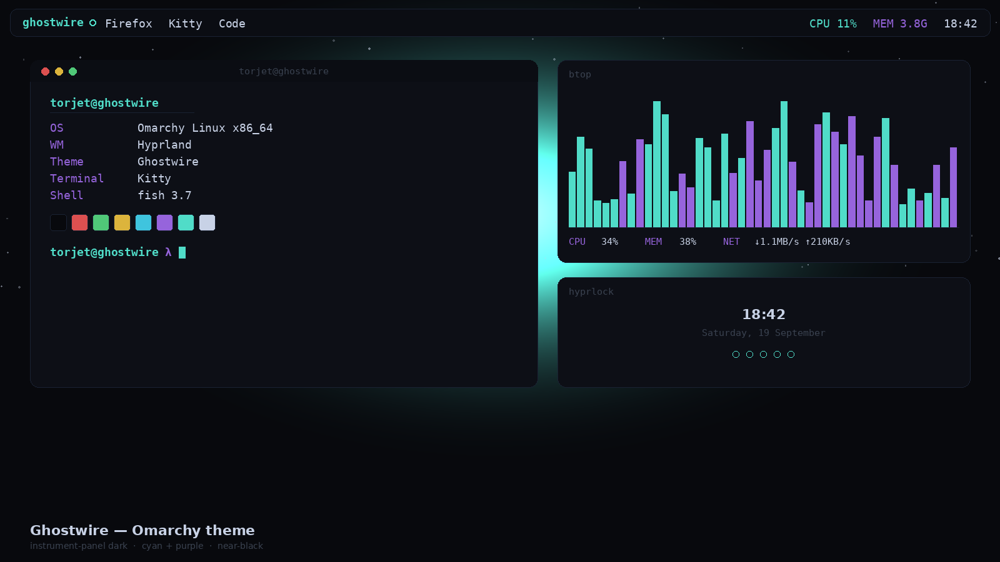

# Ghostwire — Omarchy Theme



A dark teal/purple hacker theme built from a hooded-figure-at-a-laptop
wallpaper and unified with the color palette used in the `torjet` TUI
project, so terminal, shell chrome, editor, browser, and lock screen all
read as one identity.

This follows Omarchy's real theme system: a single `colors.toml` that
Omarchy auto-generates into the terminal, Hyprland, Waybar, Hyprlock, Mako,
btop, Walker, SwayOSD, Chromium, etc. — no per-app files needed for those.

## Colors for

alacritty · btop · chromium · hyprland · hyprlock · icons · mako · neovim ·
swayosd · walker · waybar · ghostty · kitty · vscode · firefox · zen ·
discord (vencord) · fish · fzf · superfile · zed · steam

## Palette

| Role       | Hex       | Role     | Hex       |
|------------|-----------|----------|-----------|
| background | `#08090d` | color4 (blue)    | `#3FC4DE` |
| foreground | `#C8D2E6` | color5 (magenta) | `#9664DC` |
| accent/cursor | `#50DCC8` | color6 (cyan) | `#50DCC8` |
| color1 (red)   | `#DC5050` | color2 (green) | `#50C878` |
| color3 (yellow)| `#DCB43C` | color8 (dim)   | `#3a4250` |

## Install on Omarchy

**Simplest — install via URL:**

```bash
omarchy-theme-install https://github.com/vispobish01-netizen/omarchy-ghostwire-theme
```

or from the menu: `Super + Alt + Space` → *Install > Theme* → paste that same URL.

Either way Omarchy clones the repo, regenerates terminal (Kitty/Ghostty/
Alacritty), Hyprland, Waybar, Hyprlock, Mako, btop, Walker, and SwayOSD
colors from `colors.toml` automatically, sets `backgrounds/ghostwire.png`
as your wallpaper, and the native Hyprlock unlock screen picks up
`unlock.png` (see *Lock screen* below).

**Manual / local copy of this folder:**

```bash
mkdir -p ~/.config/omarchy/themes
cp -r ghostwire-theme ~/.config/omarchy/themes/ghostwire
omarchy-theme-set ghostwire
```

Then `Super + Alt + Space` → *Style > Theme* → select **Ghostwire**.

**Getting it listed publicly:** the official route is pinging `@tahayvr` on
the Omarchy Discord (`#omarchy`) to get added to the
[Extra Themes](https://learn.omacom.io/2/the-omarchy-manual/90/extra-themes)
manual page. Third-party galleries like omarchythemes.com appear to mirror
repos tagged with the `omarchy-theme` GitHub topic — add that topic to the
repo once it's public.

## What's inside

- `colors.toml` — the 22 required color keys Omarchy templates everything from
- `preview.png` — desktop preview for the theme gallery / listing
- `unlock.png` + `preview-unlock.png` — native Hyprlock unlock screen image
  and its preview, shown under *Style > Unlock*
- `backgrounds/` — sixteen wallpapers, cycle between them with `Super + Ctrl + Space`:
  - `ghostwire.png` — the original hooded-figure-at-a-laptop wallpaper (default)
  - `ghostwire-the-watcher.png` — a large hooded silhouette back-lit by a
    noise-textured cyan/purple aurora halo, starfield above, faint laptop-glow
    at the base
  - `ghostwire-neon-skyline.png` — layered cyberpunk city silhouette (three
    depth bands), hundreds of lit cyan/purple windows, a soft-glow moon, stars
  - `ghostwire-code-rain.png` — Matrix-style falling glyph columns (real
    monospace characters), bright white leading char + fading cyan/purple trail
  - `ghostwire-aurora-peaks.png` — low-poly mountain ridgelines under noise-warped
    cyan/purple/blue aurora ribbons and a starfield, cyan rim-light on the front ridge
  - `ghostwire-circuit-drift.png` — glowing PCB-style traces (with real bloom)
    branching outward from a central cyan hub, cyan/purple, starfield background
  - `ghostwire-data-horizon.png` — synthwave-style perspective grid floor with
    a banded yellow/red/purple sun glowing on the horizon
  - `ghostwire-nebula-veil.png` — soft, dark cyan/purple nebula clouds (real
    fractal noise) drifting behind a dense starfield
  - `ghostwire-shattered-glass.png` — Voronoi-based low-poly glass facets with
    glowing cyan/purple crack lines near the center
  - `ghostwire-radar-sweep.png` — concentric radar rings, crosshair, a rotating
    cyan sweep wedge with real falloff, and glowing green/purple blips
  - `ghostwire-glitch-scan.png` — horizontal scanline bands with real pixel-shift
    and RGB-channel-split glitches, cyan/purple accent lines, CRT scanline texture
  - `ghostwire-wireframe-globe.png` — a tilted 3D wireframe globe (lat/long
    great-circles with front/back depth shading), glowing cyan, starfield backdrop
  - `ghostwire-neural-mesh.png` — a three-layer organic node-link network
    (nearest-neighbour graph) spread across the full frame, purple/blue/cyan by depth
  - `ghostwire-pulse-grid.png` — three oscilloscope waveforms with pulse spikes
    over a faint grid, cyan/purple/blue traces, a sweeping cyan cursor line
  - `ghostwire-signal-drift.png` — hundreds of flow-field particle streams
    drifting left to right, cyan/purple/blue with bright leading heads
  - `ghostwire-orbit-rings.png` — four tilted elliptical orbits around a glowing
    cyan nucleus, one satellite node per orbit, starfield backdrop

  All sixteen are procedurally generated to match the palette — no external
  images, so no licensing to worry about. The fifteen generated ones use real
  fractal (simplex) noise, layered bloom/glow, and a shared palette-aware
  toolkit rather than flat gradients, so they hold up at full brightness.
- `icons.theme` — sets file-manager icons to `Yaru-purple` to match the accent
- `btop.theme` — hand-tuned btop theme (not the auto-generated one): purple/cyan/blue/yellow
  box outlines per panel, green→yellow→red load gradients, cyan→blue→purple
  network/process gradients. Drop-in — Omarchy keeps hand-written per-app files as-is
  instead of regenerating them from `colors.toml`.
- `neovim.lua` — self-contained Neovim colorscheme (`:colorscheme ghostwire`), no plugin
  dependency. Covers core UI, syntax, diagnostics, Treesitter, Telescope, and
  nvim-tree/neo-tree highlight groups. Usage:
  ```bash
  mkdir -p ~/.config/nvim/colors
  cp neovim.lua ~/.config/nvim/colors/ghostwire.lua
  ```
  then `:colorscheme ghostwire` (or `vim.cmd.colorscheme("ghostwire")` in your config).
- `lock-design/` — a **bonus, non-native** glitch-clock lock screen
  (`Ghostwire.qml`, see `lock-design/INSTALL.md`) for the third-party
  "Lock Screen Explorer" Hyprlock plugin. This is separate from the native
  `unlock.png` above — install it only if you already use that plugin.

**Hand-tuned extras beyond what `colors.toml` auto-generates** (Omarchy keeps
any file a theme ships instead of templating it — see [Making your own
theme](https://omarchy.org/manual/making-your-own-theme/)):

- `gtk.css` — GTK4/libadwaita apps (Nautilus, Settings, Text Editor). Omarchy's
  auto-template list covers terminal/Hyprland/Waybar/btop/etc but **not** GTK
  apps, so this fills a real gap rather than just adding polish.
- `waybar.css` — rounded pill workspaces/modules, cyan active-workspace fill,
  per-module color coding (cpu=blue, mem=purple, clock=cyan), blinking red on
  critical battery.
- `walker.css` — glass panel launcher, cyan caret/selection, purple keybind
  chips. Selector IDs follow Walker's default widget tree — check
  `GTK_DEBUG=interactive walker` if your version differs.
- `mako.ini` — per-urgency border colors (dim/cyan/red), rounded glass-panel
  notifications, network/mount category accents.
- `swayosd.css` — rounded OSD popup, cyan progress fill, purple for capslock,
  red for muted.
- `cava_theme` — audio visualizer bars in the cyan→blue→purple identity
  gradient. Merge into `~/.config/cava/config`.

These six are genuine hand-written overrides (not just re-exports of
`colors.toml`), so an `omarchy theme install` from a git copy of this repo
would keep all of them as-is.

## Shell, editor, browser, chat

- `starship.toml` — cross-shell prompt: purple OS/user segment, dark
  directory pill, cyan git branch, yellow git status, cyan/red success/error
  arrow, plus language-version segments (node/python/rust/go) in accent colors.
  Install: `cp starship.toml ~/.config/starship.toml` (or symlink it so it
  follows theme switches).
- `fastfetch.jsonc` + `ghostwire-ascii.txt` — a hand-drawn block-art Ghostwire
  logo (cyan outline, purple shading, bright eyes) with a module list tuned
  for a Hyprland/Omarchy box. Install:
  ```bash
  mkdir -p ~/.config/fastfetch
  cp fastfetch.jsonc ghostwire-ascii.txt ~/.config/fastfetch/
  ```
  then `fastfetch --config ~/.config/fastfetch/fastfetch.jsonc` (or overwrite
  your default `config.jsonc`).
- `vscode-theme/` — a real, standalone VS Code theme extension (not just a
  pointer to someone else's marketplace theme): full `tokenColors` +
  workbench `colors`, covering editor, terminal ANSI colors, git decorations,
  and more. Install locally:
  ```bash
  cp -r vscode-theme ~/.vscode/extensions/ghostwire-theme
  ```
  then reload VS Code and pick **Ghostwire** from the theme picker. `vscode.json`
  at the theme root is Omarchy's normal pointer format, but Omarchy's
  auto-installer expects a *marketplace* extension id — since this one is
  local-only, `omarchy-theme-set` will try and fail to auto-install it; the
  manual copy above is the reliable path unless you later publish the
  extension yourself.
- `chromium.theme` — `13,17,23` (the RGB form of `#08090d`), Omarchy's format
  for theming Chromium/Chrome/Edge/Brave via managed policy.
- `firefox/userChrome.css` + `firefox/userContent.css` — recolors toolbar,
  tabs, URL bar, and Firefox's own pages (new tab, reader mode, PDF viewer).
  Needs `toolkit.legacyUserProfileCustomizations.stylesheets = true` in
  `about:config`, then both files go in `<profile>/chrome/`.
- `vencord.theme.css` — Discord (via Vencord) recolored using Discord's CSS
  variables, so it survives Discord updates. Two selectors near the bottom
  target Discord's hashed classnames (selected-server bar, badges) and *can*
  go stale on a Discord update — if the accents on those two elements stop
  applying, just delete those two rules; the `:root` variables (which cover
  nearly everything) aren't affected. Install: Vencord Settings → Themes →
  drop the file in your themes folder → enable it.

## Explicit configs (beyond `colors.toml` auto-templating)

Omarchy auto-generates terminal/Hyprland/Hyprlock/Waybar/etc from
`colors.toml`, so these aren't required — but shipping them explicitly gives
finer control (opacity, borders, custom Hyprlock layout) than the generic
template, matching what the more detailed community themes ship.

- `alacritty.toml`, `kitty.conf`, `ghostty.conf` — explicit terminal color +
  opacity configs. Merge into each app's own config, or point the app at
  `~/.config/omarchy/current/theme/<file>` via an `import`/`include` line.
- `hyprland.conf` — explicit border gradient (cyan→purple), rounding, blur,
  and a custom bezier/animation set, instead of the generic template.
- `hyprlock.conf` — a **hand-built native Hyprlock layout**: large centered
  clock, date line, the "state: you are not here" easter egg, and a styled
  input field (cyan outline, purple capslock indicator, red fail state) —
  not just a background swap. Copy to `~/.config/hypr/hyprlock.conf`.
- `colors.fish` + `fzf.fish` — fish shell syntax-highlight colors and fzf's
  `FZF_DEFAULT_OPTS`. Merge into `~/.config/fish/config.fish` or source them
  from there.
- `superfile.toml` — theme for the [Superfile](https://superfile.netlify.app)
  terminal file manager. Copy to `~/.config/superfile/theme/ghostwire.toml`
  and set `theme = "ghostwire"` in Superfile's `config.toml`. Superfile's
  theme keys have changed across versions — if a key is silently ignored,
  check `spf`'s current theme docs.
- `zed.json` — a full [Zed](https://zed.dev) editor theme (editor, terminal
  ANSI colors, syntax highlighting). Copy to `~/.config/zed/themes/ghostwire.json`,
  then pick **Ghostwire** from Zed's theme selector.
- `steam.css` — accent colors for a Steam client CSS loader such as
  [Millennium](https://steambrew.app). Steam's internal class names shift
  between client updates, so treat this as a starting point rather than a
  guaranteed drop-in.
- `zen.css` — a pointer file: [Zen Browser](https://zen-browser.app) uses the
  same `userChrome.css`/`userContent.css` mechanism as Firefox, so the actual
  rules are the `firefox/` files above — copy both into the Zen profile's
  `chrome/` folder. Zen's own accent-color setting (native tab sidebar,
  workspaces) is separate from userChrome and should be set to `#50dcc8`
  manually in Zen's settings.

## Notes

- Cursor and accent are both set to the cyan (`#50DCC8`) identity color.
- `color5`/`color12` lean toward the purple end of the wallpaper's gradient.
- `preview.png`, `preview-unlock.png`, `unlock.png`, and the two new
  backgrounds (`ghostwire-the-watcher.png`, `ghostwire-aurora-peaks.png`)
  are freshly generated procedural art matching this palette — no external
  or AI-photoreal source images are bundled, to keep the repo license-clean.

## License

MIT — see [`LICENSE`](LICENSE). Free to use, modify, and redistribute.
